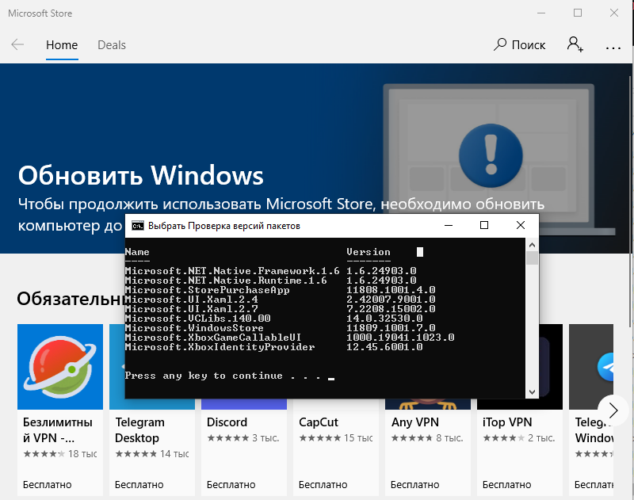
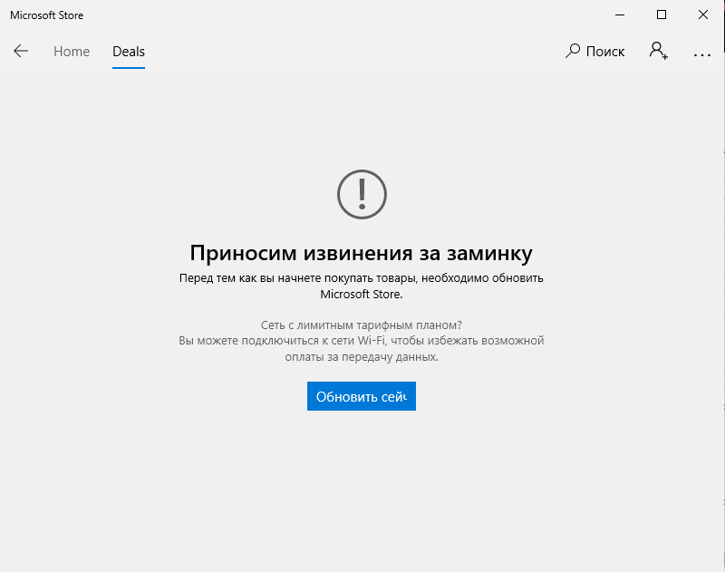
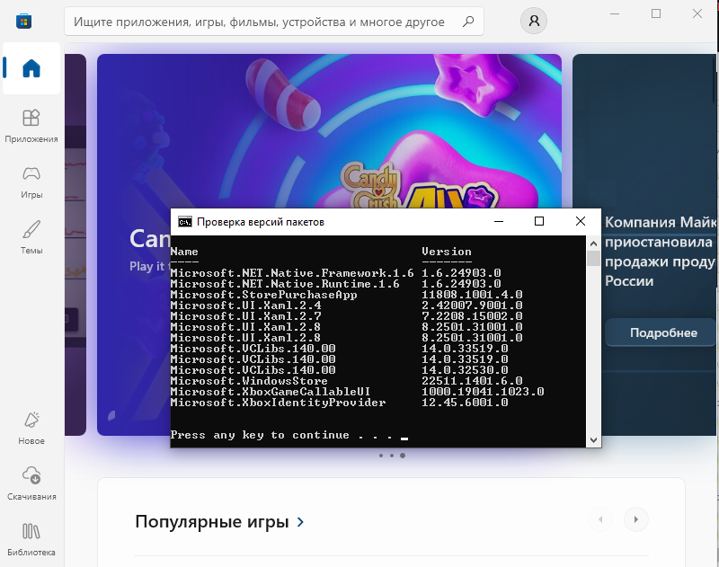

# LTSC_MS-Store_2021_Installer

Автоматизированная установка Microsoft Store в Windows 10 LTSC 2021 двумя способами: в WIM-образ (offline) и в запущенную систему (online).

Форк проекта [kkkgo/LTSC-Add-MicrosoftStore](https://github.com/kkkgo/LTSC-Add-MicrosoftStore) с расширенным функционалом и поддержкой двух методов установки.

## Что нового в этом форке

- ✅ **Два метода установки**: offline в образ и online в систему
- ✅ Полная автоматизация процесса с проверками
- ✅ Установка с XML-лицензиями для надежности
- ✅ Современный интерфейс с русской локализацией
- ✅ Проверка прав администратора
- ✅ Скрипт проверки установленных версий

## Описание

Репозиторий содержит скрипты для установки Microsoft Store двумя способами:

### 1. **Offline-установка** - в WIM-образ через DISM
- Для интеграции Store в установочный образ Windows
- Монтирование VHD → развертывание WIM → вшивание Store

### 2. **Online-установка** - в запущенную систему
- Для установки Store на уже работающую LTSC
- Быстрая установка через PowerShell с зависимостями

## Содержимое
```
├── Add_Store_to_WIM_2021.bat       # Offline: вшивание в WIM-образ
├── Add_Store_to_System_2021.bat    # Online: установка в запущенную систему
├── Check_version_Store.bat         # Проверка установленных версий пакетов
├── Packages/                       # Папка с пакетами Store и зависимостями
└── README.md                       # Этот файл
```

## Установленные компоненты

**Основные пакеты:**
- **Microsoft Store** 11809.1001.713.0
- **Store Purchase App** 11808.1001.413.0
- **Xbox Identity Provider** 12.45.6001.0
- **Desktop App Installer** 1.6.29000.1000

**Зависимости:**
- Microsoft.UI.Xaml 2.4 (2.42007.9001.0)
- Microsoft.UI.Xaml 2.7 (7.2208.15002.0)
- Microsoft.VCLibs.140.00 (14.0.26706.0)
- Microsoft.VCLibs.140.00 (14.0.32530.0)
- Microsoft.NET.Native.Runtime 1.6 (1.6.24903.0)
- Microsoft.NET.Native.Framework 1.6 (1.6.24903.0)

## Использование

### Способ 1: Online-установка в запущенную систему

**Для быстрой установки Store на работающую LTSC:**

1. Запустите `Add_Store_to_System_2021.bat` от имени администратора
2. Подтвердите начало установки
3. Дождитесь завершения (автоматическая установка зависимостей + основных пакетов)
4. Перезагрузите систему

**Требования:**
- Windows 10 LTSC 2021 (build 19041+)
- Права администратора
- Все файлы из папки `Packages`

**Процесс установки:**
1. Проверка прав администратора
2. Установка зависимостей (NET, Xaml, VCLibs)
3. Установка основных компонентов с лицензиями:
   - [1/4] Desktop App Installer
   - [2/4] Xbox Identity Provider
   - [3/4] Store Purchase App
   - [4/4] Microsoft Store

### Способ 2: Offline-установка в WIM-образ

**Для интеграции Store в установочный образ Windows:**

1. Смонтируйте VHD в систему
2. Разверните WIM на VHD через DISM++
3. Запустите `Add_Store_to_WIM_2021.bat` от имени администратора
4. Укажите букву диска с развернутым образом (например, G)
5. Дождитесь завершения установки
6. Сохраните изменения и размонтируйте образ в DISM++

**Требования:**
- VHD смонтирован в систему
- WIM развернут на VHD через DISM++
- Права администратора
- XML лицензии для каждого компонента

**Процесс установки:**
1. Проверка прав администратора
2. Проверка существования указанного диска
3. Установка пакетов с зависимостями через DISM
4. Интеграция в образ для всех будущих пользователей

## Проверка установки

Запустите `Check_version_Store.bat` чтобы увидеть список установленных пакетов и их версии.

**Пример вывода:**
```
Name                                    Version
----                                    -------
Microsoft.NET.Native.Framework.1.6      1.6.24903.0
Microsoft.NET.Native.Runtime.1.6        1.6.24903.0
Microsoft.StorePurchaseApp              11808.1001.4.0
Microsoft.UI.Xaml.2.4                   2.42007.9001.0
Microsoft.UI.Xaml.2.7                   7.2208.15002.0
Microsoft.VCLibs.140.00                 14.0.32530.0
Microsoft.WindowsStore                  11809.1001.7.0
Microsoft.XboxIdentityProvider          12.45.6001.0
```

## Скриншоты

### После установки

*версии пакетов после установки*

### Вкладка Deals -> 'Обновить сейчас'

*местонахождение кнопки обновить Microsoft Store*

### После обновления

*Версии компонентов после обновления*


## Особенности реализации

**Online-установка:**
- Использует `Add-AppxPackage` для зависимостей
- Использует `Add-AppxProvisionedPackage -Online` с лицензиями для основных пакетов
- Установка для всех пользователей системы
- Скрытый вывод технической информации

**Offline-установка:**
- Использует `DISM /Image:` для монтированного образа
- Явное указание зависимостей через `/DependencyPackagePath`
- Использование XML-лицензий через `/LicensePath`
- Подробный вывод процесса установки

## Структура папки Packages
```
Packages/
├── Microsoft.WindowsStore_11809.1001.713.0_neutral_~_8wekyb3d8bbwe.AppxBundle
├── Microsoft.WindowsStore_8wekyb3d8bbwe.xml
├── Microsoft.StorePurchaseApp_11808.1001.413.0_neutral_~_8wekyb3d8bbwe.AppxBundle
├── Microsoft.StorePurchaseApp_8wekyb3d8bbwe.xml
├── Microsoft.XboxIdentityProvider_12.45.6001.0_neutral_~_8wekyb3d8bbwe.AppxBundle
├── Microsoft.XboxIdentityProvider_8wekyb3d8bbwe.xml
├── Microsoft.DesktopAppInstaller_1.6.29000.1000_neutral_~_8wekyb3d8bbwe.AppxBundle
├── Microsoft.DesktopAppInstaller_8wekyb3d8bbwe.xml
├── Microsoft.UI.Xaml.2.4_2.42007.9001.0_x64__8wekyb3d8bbwe.Appx
├── Microsoft.UI.Xaml.2.7_7.2208.15002.0_x64__8wekyb3d8bbwe.appx
├── Microsoft.VCLibs.140.00_14.0.26706.0_x64__8wekyb3d8bbwe.Appx
├── Microsoft.VCLibs.140.00_14.0.32530.0_x64__8wekyb3d8bbwe.appx
├── Microsoft.NET.Native.Runtime.1.6_1.6.24903.0_x64__8wekyb3d8bbwe.Appx
└── Microsoft.NET.Native.Framework.1.6_1.6.24903.0_x64__8wekyb3d8bbwe.Appx
```

## Известные особенности

- После установки Microsoft Store может запросить обновление Windows (это нормально)
- VCLibs может показать предупреждение если более новая версия уже установлена (не критично)
- Рекомендуется перезагрузка системы после установки
- Store автоматически обновится до последней версии при первом запуске с интернетом

## Источники пакетов

Все пакеты скачаны с официального генератора прямых ссылок Microsoft Store:
- **https://ru.store.rg-adguard.net/** (для России)
- **https://store.rg-adguard.net/** (для других стран)

### Как скачать пакеты самостоятельно

#### Для пользователей из России

Из-за региональных ограничений прямое скачивание заблокировано, но есть рабочий метод:

1. **Откройте https://ru.store.rg-adguard.net/** (VPN **ВЫКЛЮЧЕН**)
2. В левом выпадающем списке выберите `URL (link)`
3. В правом выпадающем списке выберите `Retail`
4. Вставьте ссылку на приложение из Microsoft Store
5. Нажмите галочку ✓ для поиска
6. **Найдите нужный файл** (.appx/.appxbundle/.msix) в списке результатов
7. **Скопируйте ссылку** на файл (правая кнопка мыши → Копировать адрес ссылки)
8. **Включите VPN**
9. **Вставьте скопированную ссылку в адресную строку** браузера
10. Файл начнет скачиваться

**Важно:** Без VPN скачивание файлов из России заблокировано! Порядок критичен: сначала получаем ссылку без VPN, потом скачиваем через VPN.

#### Для пользователей не из России

1. **Откройте https://store.rg-adguard.net/**
2. В левом выпадающем списке выберите `URL (link)`
3. В правом выпадающем списке выберите `Retail`
4. Вставьте ссылку на приложение из Microsoft Store
5. Нажмите галочку ✓ для поиска
6. Скачайте нужные файлы (.appx/.appxbundle/.msix) напрямую

### Прямые ссылки на компоненты в Microsoft Store

Для поиска на https://ru.store.rg-adguard.net/ используйте эти ссылки:

**Основные компоненты:**
- **Microsoft Store**  
  `https://apps.microsoft.com/detail/9wzdncrfjbmp`
  
- **Store Purchase App**  
  `https://apps.microsoft.com/detail/9dg5k7cxq4rp`
  
- **Xbox Identity Provider**  
  `https://apps.microsoft.com/detail/9wzdncrd1hkw`
  
- **Desktop App Installer (winget)**  
  `https://apps.microsoft.com/detail/9nblggh4nns1`

**Зависимости (UI.Xaml, VCLibs, NET.Native)** появляются в списке результатов при поиске основных компонентов. Скачивайте версии для **x64** архитектуры.

## Важно: О версиях пакетов

**Не используйте последние версии пакетов!** 

При установке самых свежих версий Microsoft Store и всех зависимостей **двойной клик по .appx/.msix файлам не работает**. Попытки ручного включения через реестр результатов не дали. Причина несовместимости неизвестна.

**Проверенные рабочие версии (из этого репозитория):**
- Desktop App Installer **1.6.29000.1000**
- Microsoft Store **11809.1001.713.0**
- Store Purchase App **11808.1001.413.0**
- Xbox Identity Provider **12.45.6001.0**
- Соответствующие версии зависимостей (UI.Xaml, VCLibs, NET.Native)

После установки этих версий Microsoft Store можно **обновить вручную** через интерфейс (кнопка "Обновить" во вкладке Deals/Library). После обновления через интерфейс Store всё работает корректно, включая двойной клик по .appx файлам.

**Используйте версии из папки `Packages` этого репозитория - они проверены и работают!**

**Примечание:** При поиске Microsoft Store на https://ru.store.rg-adguard.net/ в результатах появляются все необходимые зависимости. Скачивайте версии для **x64** архитектуры, которые указаны выше.

## Совместимость

- ✅ Windows 10 LTSC 2021 (build 19041+)
- ✅ Windows 10 LTSC 2019 (возможны проблемы с версиями пакетов)
- ❌ Windows 11 (используйте другие методы)

## Автор

**NaitSide** - 2026

Оригинальный проект: [kkkgo/LTSC-Add-MicrosoftStore](https://github.com/kkkgo/LTSC-Add-MicrosoftStore)

## Лицензия

Все пакеты принадлежат Microsoft Corporation.  
Скрипты распространяются "как есть" без гарантий.